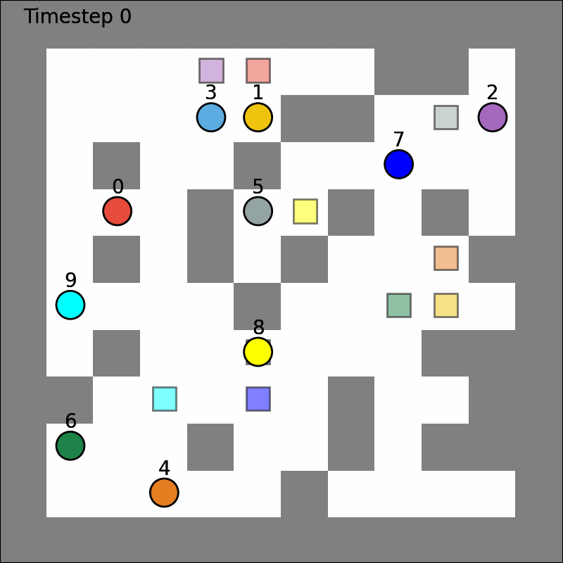

# Multi-Agent Path Finding (MAPF)

Imagine a warehouse with several robots that all need to get from where they are to a
delivery point, at the same time, without crashing into each other or trying to pass
through the same doorway at once. That's the **Multi-Agent Path Finding (MAPF)** problem:
given a map (a graph of connected locations) and a set of agents, each with a start and a
goal, find a path for every agent so that none of them ever collide — while keeping the
total travel time as short as possible.



## Objective and constraints

Each agent $i$ follows a path $\pi_i$: a sequence of positions, one per discrete time step
$t = 0, 1, 2, \dots$, either moving to a neighboring node or waiting in place. We want the
cheapest set of paths that gets every agent from its start to its goal without any two
agents conflicting:

$$
\min \sum_{i \in A} \text{cost}(\pi_i) \qquad \text{("sum of costs")}
$$

subject to, for every pair of agents $i \neq j$ and every time step $t$:

$$
\text{pos}_i(t) \neq \text{pos}_j(t) \qquad \text{(no two agents share a node)}
$$

$$
\neg\big(\text{pos}_i(t-1) = \text{pos}_j(t) \ \land\ \text{pos}_i(t) = \text{pos}_j(t-1)\big) \qquad \text{(no two agents swap along the same edge)}
$$

$$
\text{pos}_i(t) \in \mathcal{N}\big(\text{pos}_i(t-1)\big) \cup \{\text{pos}_i(t-1)\} \qquad \text{(only move to a neighbor, or wait)}
$$

This project solves that problem with **Conflict-Based Search (CBS)**: plan every agent's
shortest path independently, then whenever two agents conflict, branch into two
alternatives — one forbidding each agent from causing that specific conflict — and replan.

## Quick start

### Requirements
* [`uv`](https://docs.astral.sh/uv/)
* Python ≥ 3.12.

### 1. Install dependencies
```bash
uv sync
```

### 2. Run your algorithm
```bash
uv run python -m runner --format json --scenario-json <path> --topologies-dir <dir> --algorithm cbs
uv run python -m runner --format movingai --map <path.map> --scen <path.scen> --agents 10 --algorithm cbs
```

### 3. Run the tests
```bash
uv run pytest
```

## Add your own algorithm

Every solver is a `Strategy` that implements the `MAPFSolver` contract
(`src/domain/interfaces.py`):

```python
from domain import MAPFSolver, Scenario, ExecutionResult

class MySolver(MAPFSolver):
    @property
    def name(self) -> str:
        return "my_solver"

    def solve(self, scenario: Scenario, seed: int | None = None) -> ExecutionResult:
        ...  # return an ExecutionResult with the paths you found
```

Then register it in the `SOLVERS` dict in `src/runner.py`, and run it with
`--algorithm my_solver`.

## Documentation

Full docs (architecture, data loaders, and how everything fits together):
https://optimizacionupb.github.io/mapf/
