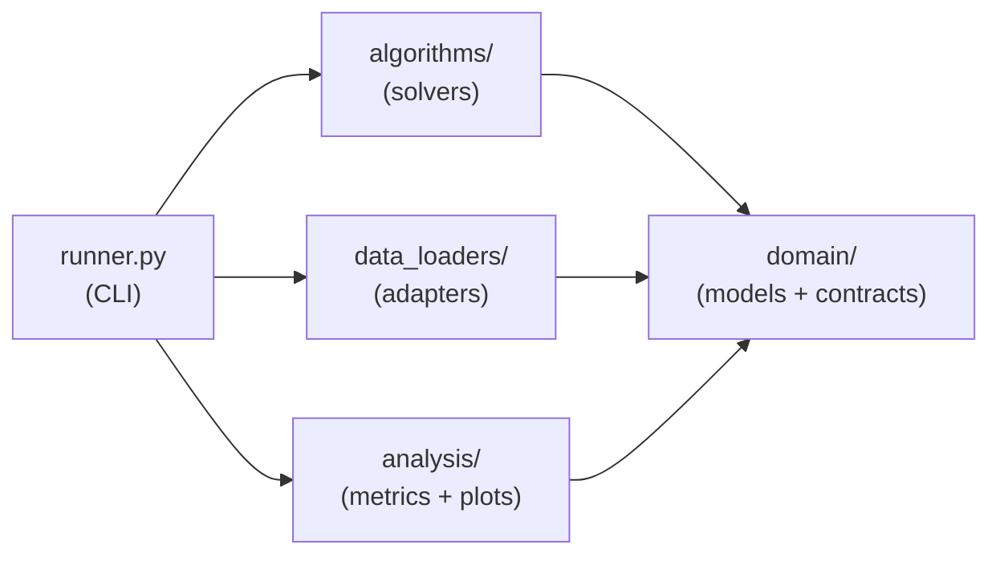

# Architecture

Four layers, each only depending on the one below it:



## Domain (`src/domain/`)

Plain dataclasses with no behavior — `Node`, `GraphTopology`, `Agent`, `Scenario`,
`TrajectoryPoint`, `AgentPath`, `ExecutionResult` (`models.py`) — plus the `MAPFSolver`
Strategy contract every algorithm implements (`interfaces.py`):

```python
class MAPFSolver(ABC):
    @property
    @abstractmethod
    def name(self) -> str: ...

    @abstractmethod
    def solve(self, scenario: Scenario, seed: int | None = None) -> ExecutionResult: ...
```

Nothing else in the project depends on a specific file format or algorithm — every other
layer talks to `Scenario` and `ExecutionResult`, never to a `.map` file or a solver's
internals directly.

## Data loaders (`src/data_loaders/`)

The Adapter pattern: `ScenarioLoader` is the contract (`base.py`), with two
implementations that both produce a domain `Scenario`:

- `JSONScenarioLoader` — a minimal custom JSON schema for a topology (nodes + weighted
  directed edges) and a scenario (agents' start/goal nodes) — see `json_loader.py` for the
  exact schema.
- `MovingAILoader` — reads a [Moving AI Lab](https://movingai.com/benchmarks/) `.map`
  (grid of passable/blocked cells, turned into a 4-neighbor graph) and `.scen` (agent
  start/goal coordinates) file pair.

Adding a new format means adding a new `ScenarioLoader` subclass — nothing else changes.

## Algorithms (`src/algorithms/`)

Solvers implement `MAPFSolver`. The current one, **Conflict-Based Search (CBS)**
(`cbs.py`), works in two levels:

- **Low-level**: Space-Time A* finds the cheapest path for one agent, given a set of
  forbidden `(node, time)` and `(edge, time)` constraints.
- **High-level**: a min-heap Constraint Tree. Each node holds one path per agent and a
  set of constraints. Pop the cheapest node, check its paths for a conflict; if none,
  it's the answer. Otherwise, branch into two children — one constraint per conflicting
  agent — and replan just that agent.

See [Adding an algorithm](extending.md) to plug in a different solver.

## Analysis (`src/analysis/`)

Pure post-processing of an `ExecutionResult` — no solver or loader knowledge. `metrics.py`
aggregates makespan/cost/runtime and counts each agent's moves vs. waits; `plots.py`
renders a static trajectory plot and a GIF animation over a `GraphTopology`; `analyze.py`
reloads a saved result JSON for post-hoc use. See
[Analysis & visualization](analysis.md).

## Runner (`src/runner.py`)

The only piece that knows about CLI arguments. It picks a `ScenarioLoader` from
`--format`, loads the `Scenario`, runs the selected `MAPFSolver`, and writes the
`ExecutionResult` as JSON to `data/results/<scenario_id>/<algorithm>/<result_id>.json`.
With `--visualize`, it also calls into `analysis/` — using the `Scenario`'s topology
already in memory — to write metrics, a trajectory plot, and a GIF animation next to
the result JSON.
