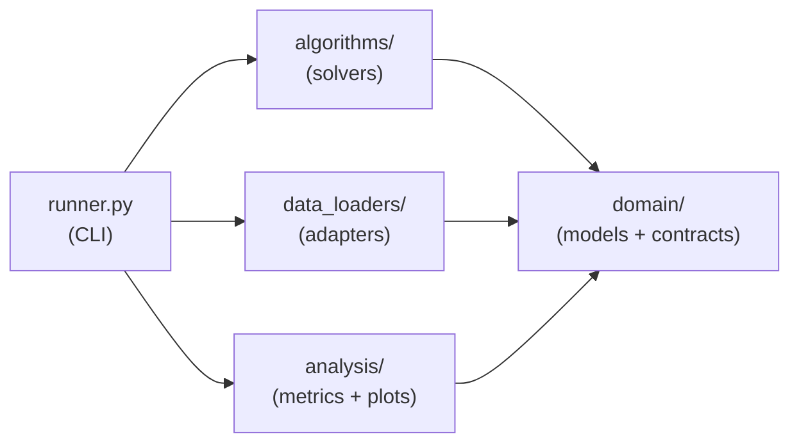

# Architecture

Four layers, each only depending on the one below it:


```mermaid
graph LR
  R["runner.py<br/>(CLI)"] --> A["algorithms/<br/>(solvers)"]
  R --> L["data_loaders/<br/>(adapters)"]
  R --> N["analysis/<br/>(metrics + plots)"]
  A --> D["domain/<br/>(models + contracts)"]
  L --> D
  N --> D
```

## Domain (`src/domain/`)

Plain dataclasses with no behavior — `Node`, `GraphTopology`, `Agent`, `Scenario`,
`TrajectoryPoint`, `AgentPath`, `ExecutionResult` (`models.py`) — plus the `MAPFSolver`
Strategy contract every algorithm implements (`interfaces.py`):

```python
class MAPFSolver(ABC):
    @property
    @abstractmethod
    def name(self) -> str: ...

    @abstractmethod
    def solve(self, scenario: Scenario, seed: int | None = None) -> ExecutionResult: ...
```

Nothing else in the project depends on a specific file format or algorithm — every other
layer talks to `Scenario` and `ExecutionResult`, never to a `.map` file or a solver's
internals directly.

## Data loaders (`src/data_loaders/`)

The Adapter pattern: `ScenarioLoader` is the contract (`base.py`), with two
implementations that both produce a domain `Scenario`:

- `JSONScenarioLoader` — a minimal custom JSON schema for a topology (nodes + weighted
  directed edges) and a scenario (agents' start/goal nodes) — see `json_loader.py` for the
  exact schema.
- `MovingAILoader` — reads a [Moving AI Lab](https://movingai.com/benchmarks/) `.map`
  (grid of passable/blocked cells, turned into a 4-neighbor graph) and `.scen` (agent
  start/goal coordinates) file pair.

Adding a new format means adding a new `ScenarioLoader` subclass — nothing else changes.

## Algorithms (`src/algorithms/`)

Solvers implement `MAPFSolver`. CBS and M\* are both optimal for sum of costs; the
hierarchical solver is a heuristic with no optimality guarantee.

**Conflict-Based Search (CBS)** (`cbs.py`) works in two levels:

- **Low-level**: Space-Time A* finds the cheapest path for one agent, given a set of
  forbidden `(node, time)` and `(edge, time)` constraints.
- **High-level**: a min-heap Constraint Tree. Each node holds one path per agent and a
  set of constraints. Pop the cheapest node, check its paths for a conflict; if none,
  it's the answer. Otherwise, branch into two children — one constraint per conflicting
  agent — and replan just that agent.

**M\*** (`mstar.py`) runs A* over the joint state of all agents, but only branches where
it has to:

- Each agent starts out following its own shortest-path policy (a backward Dijkstra from
  its goal), so a joint state has a single successor while nobody collides.
- When agents collide, they are added to the **collision set** of every state that led
  there (back-propagation), and those states are re-expanded with every move for just
  those agents. The search space only grows around actual conflicts.
- `epsilon > 0` inflates the heuristic for a faster, bounded-suboptimal search
  (`epsilon=0`, the default, is optimal).

M\* returns `status="no_solution"` only after exhausting the joint space (proven
infeasible), and `status="timeout"` if `max_expansions` or `timeout_s` is hit first.

**Hierarchical (L1 → L2 → L3)** (`hierarchical.py`) is a sampling-based, non-complete
solver built from the design in [`docs/L123.md`](L123.md):

- **L1 (flow design)**: if two opposite arcs carry a persistent contraflow signal
  `μ_ab = f_ab · f_ba` above `mu_threshold`, one direction is removed, provided every
  agent still has a path.
- **L2 (route generation)**: up to `routes_per_agent` spatial routes per agent on the
  regulated graph, each penalizing the arcs of the previous ones and adding a congestion
  term `gamma · λ̄`.
- **L3 (scheduling)**: `samples` draws of one route per agent (softmax over route cost,
  `beta`). Each draw is split into interaction components and each component is timed
  with prioritized planning over fixed routes (advance or wait only).

Only the `ExecutionResult` contract is returned; the regulated graph, route pools and
congestion stay internal. Because it samples, `status="no_solution"` means *no solution
found within the budget*, not proven infeasibility, and `status="timeout"` means
`timeout_s` ran out before any solution was found. Simple spatial routes cannot retreat
into a dead end and come back, so head-on swaps that need a passing bay can be missed.

See [Adding an algorithm](extending.md) to plug in a different solver.

## Analysis (`src/analysis/`)

Pure post-processing of an `ExecutionResult` — no solver or loader knowledge. `metrics.py`
aggregates makespan/cost/runtime and counts each agent's moves vs. waits; `plots.py`
renders a static trajectory plot and a GIF animation over a `GraphTopology`; `analyze.py`
reloads a saved result JSON for post-hoc use. See
[Analysis & visualization](analysis.md).

## Runner (`src/runner.py`)

The only piece that knows about CLI arguments. It picks a `ScenarioLoader` from
`--format`, loads the `Scenario`, runs the selected `MAPFSolver`, and writes the
`ExecutionResult` as JSON to `data/results/<scenario_id>/<algorithm>/<result_id>.json`.
With `--visualize`, it also calls into `analysis/` — using the `Scenario`'s topology
already in memory — to write metrics, a trajectory plot, and a GIF animation next to
the result JSON.
